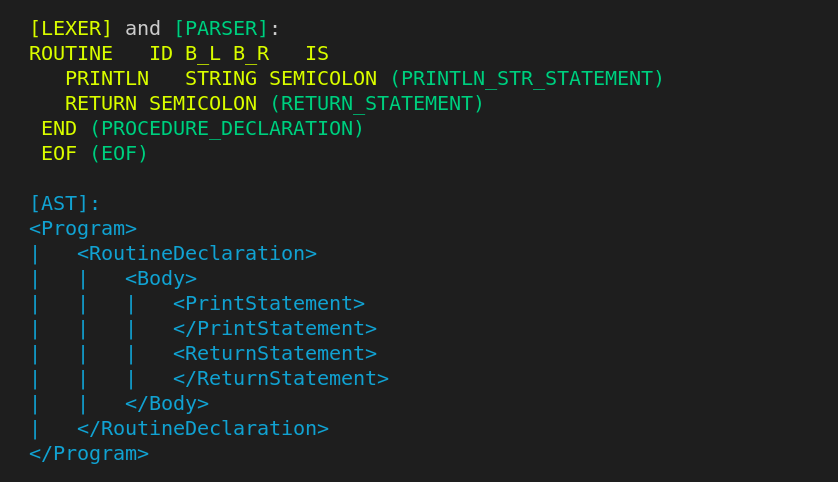

[](https://www.cplusplus.com/)
[](https://gitHub.com/sh3b0/cplus/issues/)
[](https://gitHub.com/sh3b0/cplus/pulls/)
[](https://github.com/sh3b0/cplus/blob/main/LICENSE)

# Сplus

Compiler for **C+** toy imperative language, based on [LLVM](https://llvm.org/docs/LangRef.html).

- For language syntax, semantics, and examples check [documentation.md](./docs/documentation.md)
- For formal language grammar, check [grammar.md](./docs/grammar.md)


## Getting started

- Code `sample.cp`

  ```python
  routine main() : integer is
  	println "Hello C+";
  	return 0;
  end
  ```

- Compile

  ```bash
  $ ./cplus sample.cp
  
  Compilation successful. Run ./a.out to execute
  ```

- Run

  ```bash
  $ ./a.out
  Hello C+
  ```

- Generated `ir.ll`

  ```assembly
  ; ModuleID = 'ir.ll'
  source_filename = "ir.ll"
  target triple = "x86_64-pc-linux-gnu"
  
  @fmt_s_ln = private unnamed_addr constant [4 x i8] c"%s\0A\00", align 1
  @str = private unnamed_addr constant [9 x i8] c"Hello C+\00", align 1
  
  define i64 @main() {
  entry:
    %printfCall = call i64 (i8*, ...) @printf(i8* getelementptr inbounds ([4 x i8], [4 x i8]* @fmt_s_ln, i32 0, i32 0), i8* getelementptr inbounds ([9 x i8], [9 x i8]* @str, i32 0, i32 0))
    ret i64 0
  }
  
  declare i64 @printf(i8*, ...)
  ```

  

- Debug output from `cplus -d sample.cp`

  

  

## Compilation from source (Linux)

1. Install prerequisites: `cmake flex bison clang llvm` using the package manager for your distro.

   - Example: `sudo apt install cmake flex bison clang llvm`

2. Clone repo

   ```bash
   git clone https://github.com/Sh3B0/cplus/
   cd cplus
   ```

3. Build `cplus` binary using CMake

   ```bash
   mkdir build
   cmake -S . -B build
   cmake --build build
   ```

4. Compile a source file `*.cp` (check [examples](./examples))

   ```bash
   cd build
   ./cplus -d ../examples/1.cp
   ```

5. Help

   ```bash
   $ ./cplus --help
   usage: cplus [options] infile
   	infile                 path to the source code file (*.cp) to compile.
   
   options:
   	-h, --help             show this help message and exit.
   	-d, --debug            show debug messages.
   	-o, --outfile outfile  specify executable file name.
   ```

   

## Contribution

Feel free to report a bug or suggest a feature by creating an issue.


## License

The source code is licensed under the MIT license, which you can find in the [LICENSE](./LICENSE) file.
