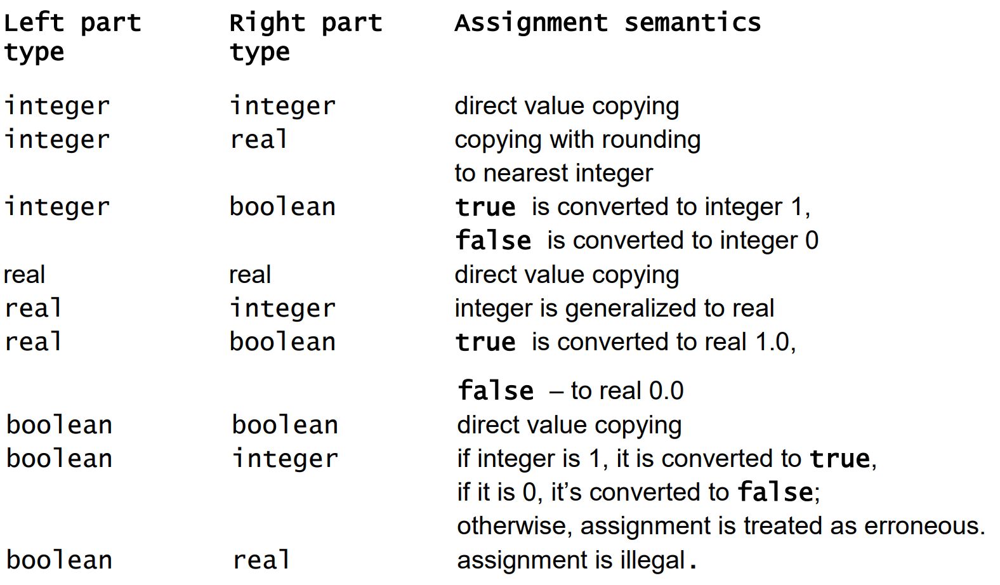

# C+ Documentation
## Variables
***
### Basic types:
Types:
- integer : Supports integer numbers from -2,147,483,648 to 2,147,483,647 (4 bytes)
- real : Supports real values that fit in 8 bytes
- boolean : Only has 2 values true or false (1 byte)

Declaration:

__var__ identifier : Type __is__ expression

__var__ identifier : Type

__var__ identifier __is__ expression

If the initial value is specified in the declaration then the type can be omitted. In such a
case, the type can be unambiguously deduced (“inferred”) from the expression that
specifies the initial value.

Examples:

```
var a : integer is 20

var b : boolean is false

var c : real is 1.5

var d : integer

var x is 5      # x becomes integer automatically

var y is true   # y becomes boolean automatically

var z is 0.5    # z becomes real automatically
```

### Compound types:
Types:
- Array : Array type is for grouping variables (“array elements”) of the same type together.
- Record : Record type is for grouping logically related variables into a single construct.

Declaration:

__record__ identifier __{__ "Variable declarations seperated by __,__ " __}__

__array__ identifier Type

__array__ identifier __[__ array size __]__ Type


Examples:

``` 
record rectangle 
    {
        var width : integer, 
        var height is 5,
        var square : boolean is false
    }

rectangle.width := 4         # sets the value of "width" in rectangle
var x is rectangle.height   # gets the value of "height" in rectangle
```
```
array numbers [5] integer

numbers[1] := 5      # sets the first element of the array
var y is numbers[5] # gets the last element of the array
```
Notes:
- Arrays in C+ are 1-indexed (First element is at index 1)
- Array size can be omitted in the array type declaration. Sizeless declaration can be
used only for specifying subroutine parameters.

### Custom types:
A short equivalent (“name”) for some type. After such a type
declaration, the identifier following the keyword type is considered as a synonym for the type specified after the is keyword. The name introduced by such a declaration can be used everywhere in its scope.

Declaration:

__type__ identifier __is__ Type

*Warning: usage isn't very clear yet.*

## Expressions
***
### Arithmetic:
Operators:
- __+__ : Addition
- __-__ : Subtraction
- __*__ : Multiplication
- __/__ : Division

Example:
```
x is 5 + 5  # 10
```
### Relational:
Operators: 
- __<__ : Smaller than
- __<=__ : Smaller than or equal
- __>__ : Bigger than
- __>=__ : Bigger than or equal 
- __=__ : Equals
- __/=__ : Not equal

Examples:
```
y is 3 > 1  # true
z is 4 = 5  # false
```
### Brackets:
Operators: __(__ , __)__

Example:
```
x is 1-4+5      # 2
y is 1-(4+5)    # -8
```

### Assignment:
Operator: __:=__

ModifiablePrimary __:=__ Expression

Example:
```
var x : integer
x := 5
```

Note: assignments follow them following assinment table



## Conditionals
***
__if__ expression __then__ body  __end__

__if__ expression __then__ body  __else__ body __end__

Examples:
```
if x < 0
then 
    x := x * -1
end
```
```
var isNegative : boolean

if x < 0
then
    isNegative := true
else
    isNegative := false
end
```

## Comments
***
You can use the '#' to mark the rest of a line as a comment

Example:
```
# This is a comment
```


